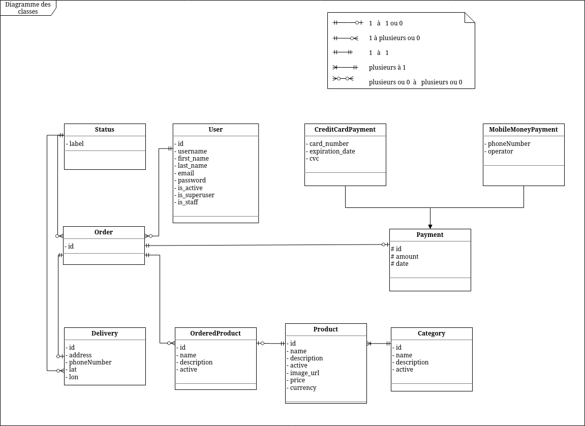

# SHOP API
> Made with Django (Django Rest Framework) 



<center>Classes diagram</center>

## Install dependencies

```bash
pip install -r requirements.txt
```

## Configure firebase for the images storing

### `/.env` file

```bash
FIREBASE_STORAGE_BUCKET=you-app-name.appspot.com
```

Replace `you-app-name` with your firebase app name 

### `/.firebase.config.json` file

> Credential of your firebase app  (JSON)

Schema

```json
{
  "type": ,
  "project_id": ,
  "private_key_id": ,
  "private_key": ,
  "client_email": ,
  "client_id": ,
  "auth_uri": ,
  "token_uri": ,
  "auth_provider_x509_cert_url": ,
  "client_x509_cert_url": ,
  "universe_domain": 
}
```

## Database migration

```bash
./manage.py makemigrations
./manage.py migrate
```

## Create super user (admin)

```bashThe
./manage.py createsuperuser
```

## Run server

```bash
./manage.py runserver
```

## API Documentation

    http://localhost:8000/swagger 
    
    Or 
    
    http://localhost:8000/redoc
 

 ## Features

    - Manage Deliveries
    - Manage payement
        - With Strip
        - With Paygate (MOOV & T-MONEY)
    - ...

<br />

Thank you 😊